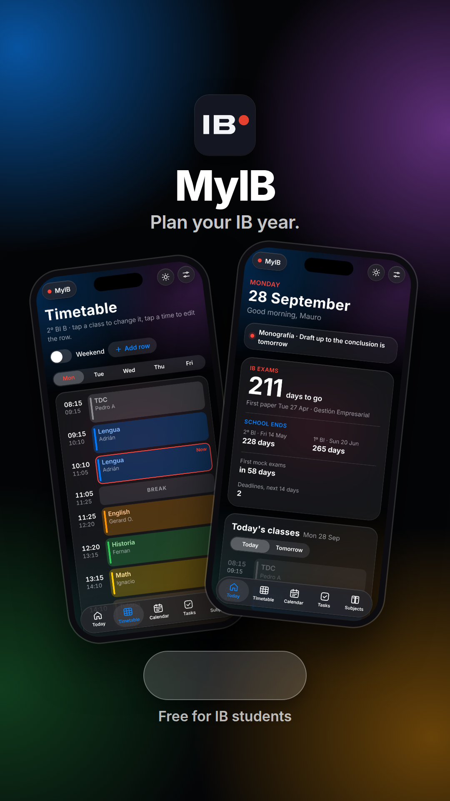
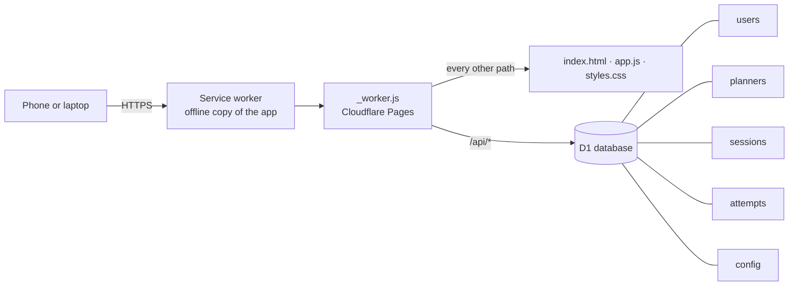
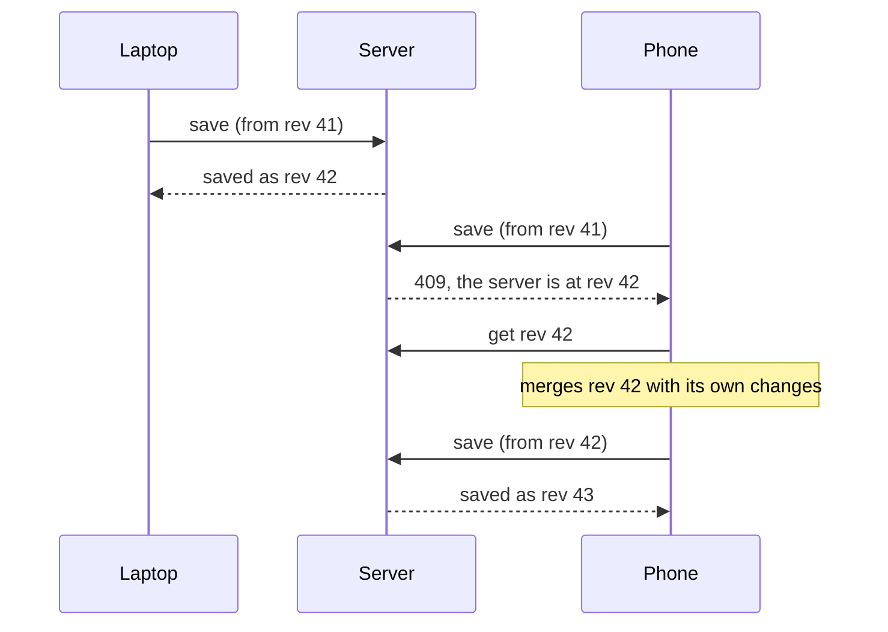
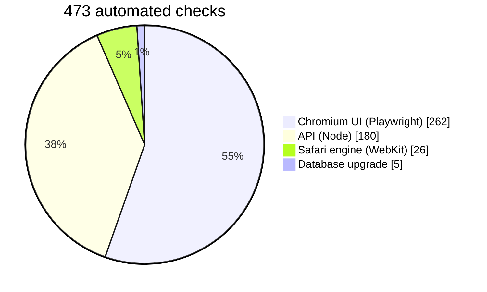

<div align="center">


# MyIB

**Your IB timetable, deadlines, exams and study time in one place.**

Built for Sociales 2 IB (2º BI B) and open to every IB student.

[](https://myib.app)




</div>

## What you get

| | |
|---|---|
| **Today** | Your classes with Now and Next tags, what's coming up, tasks for the next 3 days and a focus timer. |
| **Countdowns** | Days to your first IB exam and to the last day of school for 1º and 2º BI. |
| **Timetable** | Tap a slot to add a class. Tap a time to change the bell times. |
| **Calendar** | Deadlines, mocks, holidays and exams, as a month or a list. |
| **Tasks** | Type `#math` in a task and MyIB files it under Math. |
| **Past papers** | Links Mauro updates every month, with a New tag on fresh ones. |
| **Sync** | You see the same planner on your phone and laptop, and it opens offline. |
| **Setup guide** | New accounts start empty. You fill them in with a four-step checklist. |

**MyIB Plus** adds a live calendar feed for Apple or Google Calendar, a past-paper score log, app colours, any timer length and no pop-ups.

Sociales 2 IB students pick their name from the class list. Everyone else taps **I'm not in Sociales 2 IB** and makes an account with a username.

## How it works

One Cloudflare Pages project serves everything. `_worker.js` handles `/api/*` and serves the static files for every other path. D1 keeps accounts, planners and settings.



### Two devices, one planner

Each save carries the revision it started from. If another device saved first, the server answers 409. Your device merges both versions item by item and saves again.



## Security

- **Passwords:** PBKDF2-SHA256 with 10,000 rounds and a random salt per account.
- **Sessions:** a random token in an HttpOnly, Secure, SameSite=Strict cookie. D1 keeps its SHA-256, never the token.
- **CSRF:** every change needs the `X-MyIB` header and a same-site Origin.
- **Rate limits:** 5 wrong passwords per name per network every 15 minutes, plus caps on sign-ups per network and per day.
- **Reset codes:** one use each, and D1 stores their hash.
- **Content Security Policy:** the browser runs scripts from this site and blocks everything else.
- **Private server code:** a request for `_worker.js` gets a 404.

## Tests

473 automated checks run against `wrangler pages dev` with a local D1.



## Project layout

```text
.
├── index.html            app shell
├── app.js                views, sheets, sync, login
├── data.js               class planner, empty planner, school end dates
├── styles.css            iOS glass design, light and dark
├── sw.js                 service worker, never caches /api
├── _worker.js            accounts, planners, admin, Plus, calendar feed
├── _headers              security headers
├── manifest.webmanifest  install it as an app
└── icons/
```

No build step and no dependencies: edit a file and upload it.

## Run it on your computer

```bash
npx wrangler pages dev . --d1 DB
```

Open http://localhost:8788. Wrangler creates the local database on the first request.

## Deploy

1. In Cloudflare, go to **Workers & Pages → Create → Pages → Upload assets** and upload this folder, or a zip with these files at the top level.
2. Create a D1 database under **Storage & databases → D1**.
3. In the Pages project, open **Settings → Bindings**, add the database and name it `DB`.
4. Upload again. The worker creates its tables on the first request.
5. Add your domain under **Custom domains**.

Anyone with MyIB open gets the new version at the next quiet moment, without reloading.

## Admin

The admin account gets extra rows in **Settings → Admin**: manage accounts, edit the Past Papers section, set the Plus price and the Bizum number.

<div align="center">
<sub>Made by Mauro Villasmil for 2º BI B, 2026–27.</sub>
</div>
